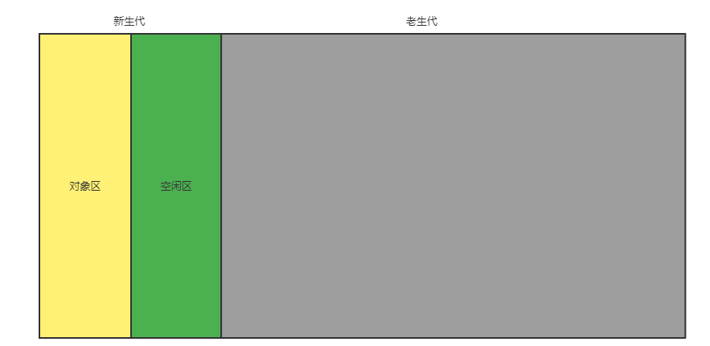
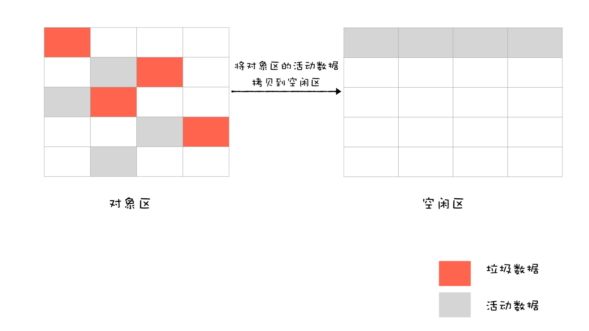
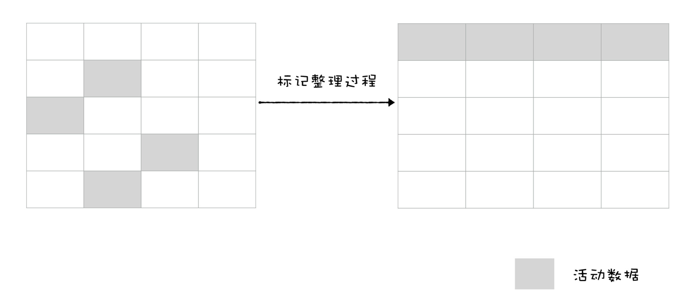
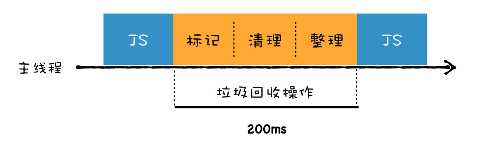
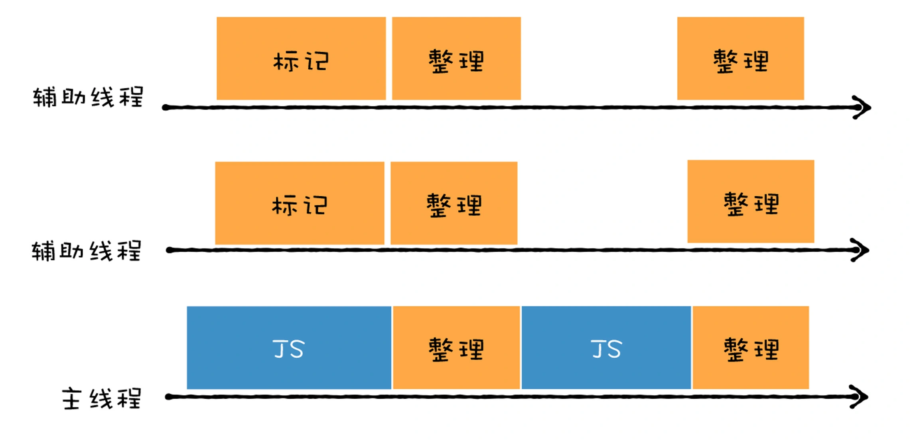

## 执行上下文 & 作用域
> 变量和函数的上下文决定了它们可以访问哪些数据，以及它们的行为。上下文在其所有代码执行完毕会被销毁。 销毁后其中的变量 以及函数都不能被访问了，但是闭包是一个例外
> 上下文中代码被执行的时候会创建一个作用域链，这个作用域链决定了各级上下文中变量和函数的访问顺序。  
> 全局上下文是 最外层的作用域链。
> 当访问一个函数或者变量的时候会根据作用域链从当前上下文中的作用域链一层一层往上找找到了就返回。有点类似于原型链上的查找。

### 垃圾回收

#### 栈内存
> 小且连续存储，由系统自动分配，自动回收。

#### 堆内存
> 垃圾回收中的内存都是堆内存。

Javascript 是使用垃圾回收的语言。也就是执行环境负责在代码执行时管理内存。通过自动内存管理来实现内存的分配和闲置资源的回收。  
大致原理就是，哪些内存不用了，就定期回收掉，释放它的内存。

- 绝大部分对象的生命周期都很短，即生命周期不长
- 生命周期很长的对象，基本都是常驻对象

**有两种方式实现：** 
-  标记清除
-  引用计数

#### 引用计数
很少会在用了，因为在循环引用的时候会有问题。计数永远都不会为0.  

原理：对每个值都记录它被引用的次数。声明一个变量并把它赋值给一个引用值的时候，它计数为1，如果同一个值又被赋值给另一个引用值，则计数加1。如果对保存该值引用的变量被其他变量覆盖了则引用计数减1。当一个值当引用为0时，表示没有地方会用到这个变量了，所以垃圾回收程序下次就可以释放引用计数为0的变量的内存了

#### 标记清除
垃圾回收程序会标记内存中所有的变量，然后将所有上下文中的变量标记给清除，当变量再被标记的时候认为是可以删除的了。随后垃圾回收程序做一次内存清理，回收它们的内存。

#### GC 算法
主要是讲 V8 中的垃圾回收算法。 

 `垃圾数据是怎么产生的`  

在当前上下文执行完毕之后，当前上下文中定义的变量或者函数都是无效的，都需要被回收掉。  

`垃圾回收是针对引用对象的，也就是针对 堆的。`

`垃圾算法回收的步骤`  

1. 通过GC Root算法标记空间中的活动对象和非活动对象
>  采用可访问性（reachability）算法 来判断对象是否为可访问的对象，就是从一些 GC Root出发开始往下遍历， 没有遍历到的对象为不可访问对象，会被标记为回收。 
> GC Root:全局 windows，文档DOM树 ...
2. 在标记完之后，统一清理标记的非活动对象。
3. **做内存整理**。因为回收对象后，内存中会存在很多不连续的空间，也叫内存对象。如果不做整理的话如果需要分别比较大的内存大话就可能分配不下。所以需要做整理。

#### 两种垃圾回收器

主要是分为 新生代，以及 老生代 算法。  

**新生代：**副垃圾回收器（Minor GC 使用 Scavenge 算法）： 新生代 会分配一小块内存区域去存储声明周期短，以及占用内存小的变量。比如定义在函数中的变量。函数执行完后会被销毁。 该内存会又会被分为两块区域。一半是对象区域，一半是空闲区域。

新加入的对象会被存入到对象区，当对象区空间快存满的时候进行一次垃圾回收处理。
垃圾回收步骤：
1. 进行标记，
2. 清理，把存活到对象复制到空闲区域，并且有序的排列起来，这个复制过程中 进行了内存整理，所以也就没有内存碎片了
3. 将空闲区和对象区进行角色转换

- 为了执行效率，会把新生区的内存设置的比较小。
- 副垃圾回收器会进行 **对象晋升策略**，把那些经过两次垃圾回收还依然存在的对象移动到主垃圾回收器。

**老生代：** 主垃圾回收器（Major GC），。老生代
- 一个是对象占用空间大；
- 另一个是对象存活时间长。  
采用 `标记-清除的算法` 进行垃圾回收  

**标记：** 从一组根元素开始，递归遍历这组根元素，在遍历的过程中，能访问的元素称为活动元素，没有达到的元素为垃圾元素，可以直接清除掉

**清除：** ： 跟副垃圾回收器的清除过程不一样，这个过程会直接把标记为垃圾的数据清除掉。但是因为你清除掉过程中会产生大量不连续的内存空间碎片。所以又引入了 `标记- 整理`算法

整理过程如下图：  

JS 是执行在主线程的，一旦执行垃圾回收程序，就会将正在执行的Javascript 脚本暂停下来，所以长时间的垃圾回收会导致程序卡顿，用户体验不好。

为了解决用户体验的问题，V8 采用 并行，并发，增量等垃圾回收机制。

- 第一，将一个完整的垃圾回收的任务拆分成多个小的任务，这样就消灭了单个长的垃圾回收任务；

- 第二，将标记对象、移动对象等任务转移到后台线程进行，这会大大减少主线程暂停的时间，改善页面卡顿的问题，让动画、滚动和用户交互更加流畅。

**并行回收：** 

V8 的副垃圾回收器所采用的就是并行策略

**增量回收：（拆解任务）**   

垃圾回收器没有必要一次执行完整的垃圾回收过程，每次执行都是垃圾会回收的过程中的一小部分工作。

  

GC Root 以及能访问到的数据

### 闭包
> 有权访问另一个作用域中变量的函数。即使在另一个作用域被销毁之后。还能继续保持访问  
> 通常是在嵌套函数中实现的。

**为什么能访问另一个作用域中的变量呢？**
