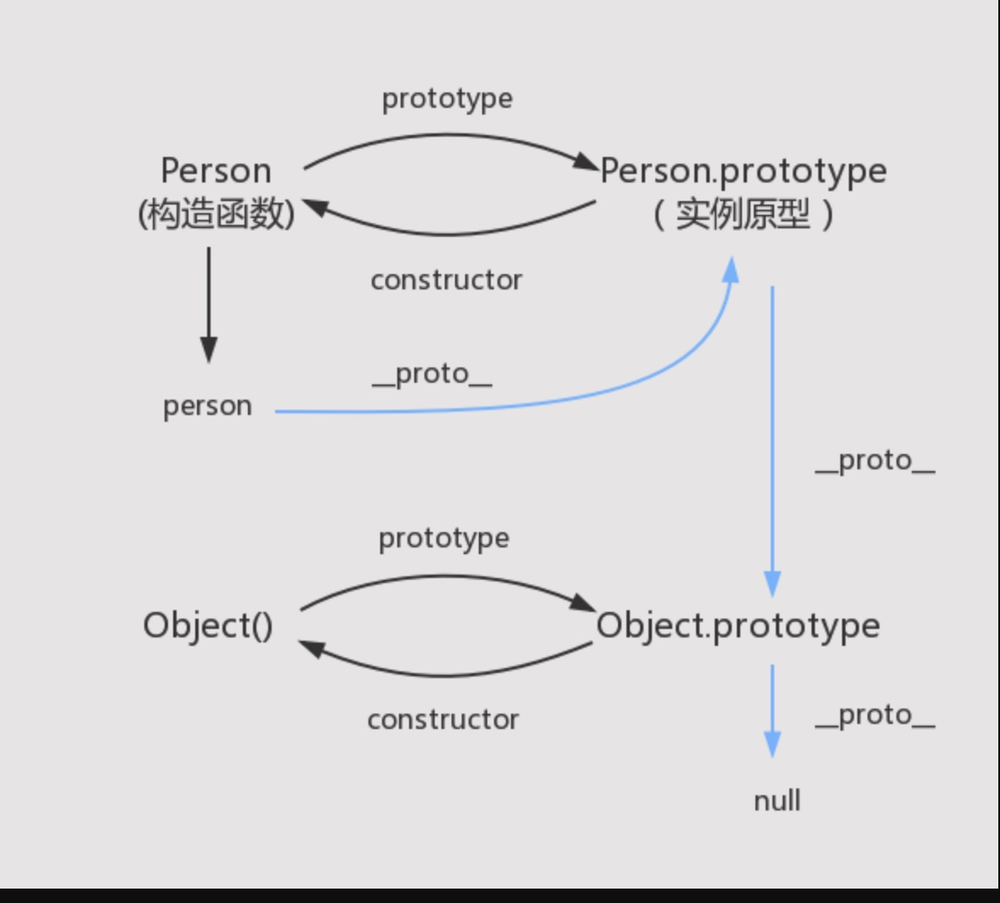

# 原型链

### 什么是原型链

> 每个函数 都会创建一个`Prototype` 属性，这个属性是一个对象，这个对象是通过构造函数创建的实例对象的原型对象。而这个原型对象有一个属性 `constructor` 来反过来指向构造函数。 通过构造函数创建的实例对象内部会有一个不可以访问的属性[[Prototype]] 这个属性指向原型对象。可以通过属性 `__proto__` 来访问。

**原型链就是 实例对象跟原型对象之间形成一条访问的链路。**

下图中蓝色的线就是原型链



## 对象

### 创建一个对象

1. 工厂模式

```js
function creatPerson(name, age) {
  let obj = new Object();
  obj.name = name;
  obj.age = age;
  obj.sayHi = function () {
    return `Hi, ${name}`;
  };
  return obj;
}
let personFactory1 = creatPerson('mars', 12);
let personFactory2 = creatPerson('zht', 19);
```

缺点：不能标识 实例对象的类型，也就是 personFactory1， personFactory2 不能通过 instanceof 来识别为具体的类型

2. 构造函数模式

```js
function Person(name, age) {
  this.name = name;
  this.age = age;
  this.sayHi = function () {
    return `Hi, ${this.name}`;
  };
}
let personConstructor1 = new Person('mars', 12);
let personConstructor2 = new Person('zht', 18);
```

缺点：每次创建新的实例 sayHi 都会被重新创建。

改进版：把 sayHi 移动到 全局。

```js
function sayHi() {
  return `Hi, ${this.name}`;
}
function Person(name, age) {
  this.name = name;
  this.age = age;
  this.sayHi = sayHi;
}
```

缺点： 会导致全局越来越多的函数。

3. 原型模式

```js
function Person(name, age) {
  this.age = age;
  this.name = name;
}
Person.prototype.sayHi = function () {
  return `Hi, ${this.name}`;
};
```

### 访问

### 遍历
1. for...in
2. for..of
3. in
4. Object.keys
5. Object.value
6. map
7. forEach
8. filter
9. Object.hasOwnProperty()
10. Object.getOwnPropertyNames()

### 其他一些知识点

1. instanceof
2. typeof
3.

## 继承

_1. 原型链继承_

```javascript
function SuperType() {
  this.superProperty = false;
}
SuperType.prototype.getProperty = function () {
  return this.superProperty;
};

function SubType() {
  this.subProperty = true;
}
// SubType 的原型链指向 SuperType的 实例对象
SubType.prototype = new SuperType();
SubType.prototype.getSubProperty = function () {
  return this.subProperty;
};

let subTypeInstance = new SubType();
console.log(subTypeInstance.getProperty()); // false
console.log(subTypeInstance.superProperty); // false
console.log(subTypeInstance.subProperty); // true
```

缺点：

1. 因为 SubType 实例对象的原型链为 SuperType 的实例，所以对于 SuperType 中的引用类型的值会在所有 SubType 实例对象中访问，访问的都是同一个地址。子类实例共享父类引用值
2. 子类的构造函数不能传参给父类的构造函数。

_2. 盗用构造函数_

> 为了解决上面两个问题：所以引入了 *盗用构造函数*的方式.  
> 原理就是在子类的构造函数中调用父类构造函数，让父类中引入值类型，变为子类的实例属性而不是放到子类原型链上。可以解决第 1 点问题，然后子类在调用父类构造函数的时候可以传参，解决第 2 个问题

```js
function SuperType() {
  this.superProperty = false;
}
SuperType.prototype.getProperty = function () {
  return this.superProperty;
};

function SubType() {
  SuperType.call(this, true);
  this.subProperty = true;
}

SubType.prototype.getSubProperty = function () {
  return this.subProperty;
};

let subTypeInstance = new SubType();
```

_缺点：_ 很明显的两个问题，

1. 函数需要在构造函数里面定义，导致所有实例都会新建一个新的函数
2. 子类不能访问父类的原型链上的方法或者属性

_3. 组合继承_

> 就是结合 原型链的方式 + 盗用构造函数的方式。  
> 方法定义在原型链上. 在子类中调用构造函数。

```js
function SuperType() {
  this.superProperty = false;
}
SuperType.prototype.getProperty = function () {
  return this.superProperty;
};

function SubType() {
  SuperType.call(this, true);
  this.subProperty = true;
}
SubType.prototype = new SuperType();
SubType.prototype.getSubProperty = function () {
  return this.subProperty;
};

let subTypeInstance = new SubType();
```

上面的组合模式其实也有问题：父类实例属性回在子类原型链何实例属性都存在一份

_4. 原型式继承_

> 创建了一个新的临时的构造函数 Foo, 最后返回 Foo 的一个实例对象。这个的实现 跟 `Object.carete()` 的实现基本一样，`create` 可以接受第二参数。
> 这个会跟原型链继承一样的问题

```js
function object(obj) {
  function Foo() {}
  const f = new Foo();
  f.prototype = obj;
  return f;
}
```

_5. 寄生式继承_

> 基本原理就是创建一个实现继承的函数，然后以某种方式增强对象，并返回这个对象

```js

function object(obj) {
  function Foo() {}
  const f = new Foo();
  f.prototype = obj;
  return f;
}

function createAnother(originObj) {
  let clone = object(originObj);
  clone.sayHi = function () {
    return `Hi, ${this.name}`
  }
  return clone;
}


```

在组合式继承中，我们会发现父类的构造函数调用了两次，一次是子类的构造函数中调用了一次，还有一次是给子类原型赋值的时候一次。
这样导致了 _父类实例属性回在子类原型链何实例属性都存在一份_。 寄生组合式继承能解决这个问题

_6. 寄生式组合继承_

> 在`组合式继承`中在构造函数中调用父类构造函数来实现对父类构造函数实例属性的继承式没有问题，问题就出现在子类原型赋值的时候。所以我们只要重写子类原型赋值的过程就行。

原理就是： `盗用构造函数模式(实现对父类实例属性的继承) + 原型式继承（获取到父类原型的一个拷贝来实现对父类原型链上的一个继承）` 

```js
function object(obj) {
  function Foo() {}
  const f = new Foo();
  f.prototype = obj;
  return f;
}

/**
 *  subType, superType 两构造函数
 **/
function inheritPrototype(subType, superType) {
  let prototype = object(superType.prototype); // 拿到父类的原型对象
  prototype.constructor = subType; // 防止 subType 的原型对象被赋值后 construct 丢失。
  subType.prototype = prototype; // 赋值原型对象
}

function SuperType() {
  this.superProperty = false;
}
SuperType.prototype.getProperty = function () {
  return this.superProperty;
};

function SubType() {
  SuperType.call(this, true);
  this.subProperty = true;
}

inheritPrototype(SubType, SuperType);

SubType.prototype.getSubProperty = function () {
  return this.subProperty;
};

```

## 类
