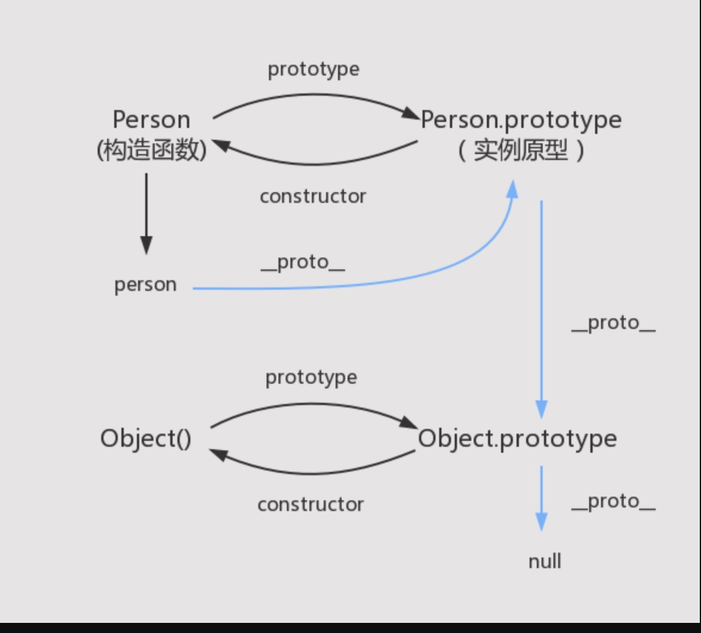

# 原型链

### 什么是原型链
> 每个函数 都会创建一个`Prototype` 属性，这个属性是一个对象，这个对象是通过构造函数创建的实例对象的原型对象。而这个原型对象有一个属性 `constructor` 来反过来指向构造函数。 通过构造函数创建的实例对象内部会有一个不可以访问的属性[[Prototype]] 这个属性指向原型对象。可以通过属性 `__proto__` 来访问。  

**原型链就是 实例对象跟原型对象之间形成一条访问的链路。**

下图中蓝色的线就是原型链


## 对象

### 创建一个对象

1. 工厂模式

```js
  function creatPerson(name, age) {
    let obj = new Object();
    obj.name = name;
    obj.age = age;
    obj.sayHi = function () {
      return `Hi, ${name}`;
    };
    return obj;
  }
  let personFactory1 = creatPerson('mars', 12);
  let personFactory2 = creatPerson('zht', 19);
```
缺点：不能标识 实例对象的类型，也就是 personFactory1， personFactory2 不能通过instanceof 来识别为具体的类型

2. 构造函数模式
```js
  function Person(name, age) {
    this.name = name;
    this.age = age;
    this.sayHi = function () {
      return `Hi, ${this.name}`;
    }
  }
  let personConstructor1 = new Person("mars", 12); 
  let personConstructor2 = new Person("zht", 18); 
```
缺点：每次创建新的实例 sayHi 都会被重新创建。

改进版：把sayHi 移动到 全局。
```js
function sayHi() {
   return `Hi, ${this.name}`;
}
  function Person(name, age) {
    this.name = name;
    this.age = age;
    this.sayHi = sayHi;
  }
```
缺点： 会导致全局越来越多的函数。

3. 原型模式

```js
  function Person(name, age) {
    this.age = age;
    this.name = name;
  }
  Person.prototype.sayHi = function() {
    return `Hi, ${this.name}`;
  }
```
### 访问

### 遍历

### 其他一些知识点

1. instanceof
2. typeof
3.

## 继承

1. 原型链

```javascript
  function SuperType() {
    this.superProperty = false;
  }
  SuperType.prototype.getProperty = function() {
    return this.superProperty;
  };

  function SubType() {
    this.subProperty = true
  };
  // SubType 的原型链指向 SuperType的 实例对象
  SubType.prototype = new SuperType();

  
```

2. 盗用构造函数


## 类
